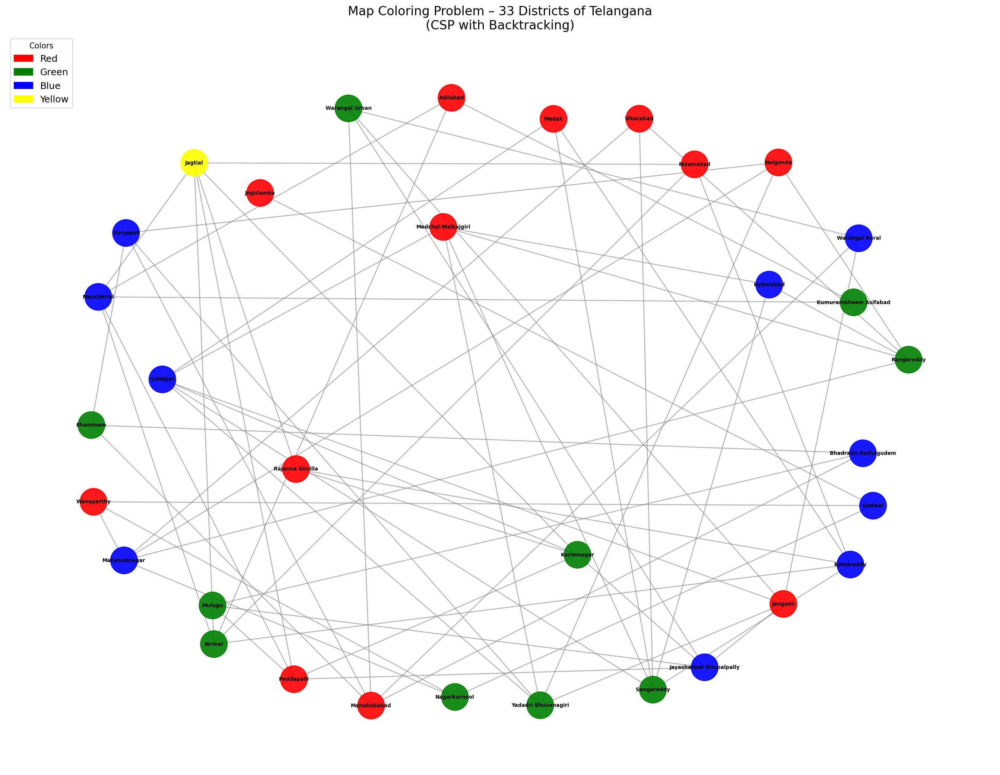

# Map Coloring Problem – 33 Districts of Telangana

A Python implementation of the **Map Coloring Problem** using **Constraint Satisfaction Problem (CSP)** with **Backtracking Search**.

## Problem Statement

Color the 33 districts of Telangana such that no two adjacent districts share the same color, using the minimum number of colors.

## Algorithm

**Backtracking Search (CSP)**

1. Represent districts as variables and colors as their domain `{red, green, blue, yellow}`
2. Constraint: no two neighboring districts can have the same color
3. Assign colors one district at a time; if a conflict is found, backtrack and try the next color

## Output

- Prints the color assigned to each of the 33 districts
- Displays a graph visualization of the colored map
- Saves the graph as `telangana_map_coloring.png`



## Result

All 33 districts successfully colored using **4 colors** — consistent with the *Four Color Theorem*.

## Requirements

```
matplotlib
networkx
```

Install with:

```bash
pip install matplotlib networkx
```

## Run

```bash
python telangana_map_coloring.py
```

## Files

| File | Description |
|------|-------------|
| `telangana_map_coloring.py` | Main source code |
| `telangana_map_coloring.png` | Output graph |
| `README.md` | This file |
