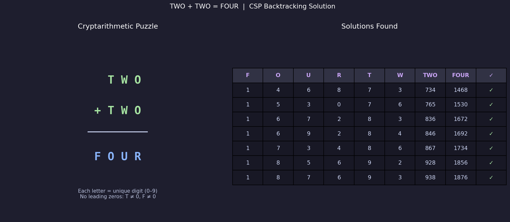

# Cryptarithmetic Puzzle – TWO + TWO = FOUR

Implementation of the **Cryptarithmetic Puzzle**  using **Constraint Satisfaction Problem ** with **Backtracking Search**.

## Problem Statement

```
  T W O
+ T W O
-------
F O U R
```

Each letter represents a distinct digit (0–9). Find all valid digit assignments such that the addition holds, with no leading zeros (T ≠ 0, F ≠ 0).

## Algorithm

**CSP with Backtracking**

1. **Variables:** F, O, U, R, T, W
2. **Domain:** digits 0–9
3. **Constraints:**
   - `2 × (100T + 10W + O) = 1000F + 100O + 10U + R`
   - Alldiff — all 6 letters must map to distinct digits
   - No leading zeros: T ≠ 0, F ≠ 0
4. Enumerate permutations, prune on constraint violation

## Output

- Prints all valid solutions to the console
- Displays a visualization of the puzzle and solutions table
- Saves the plot as `cryptarithmetic_solution.png`



## Result

**7 valid solutions** found, e.g. `734 + 734 = 1468` (T=7, W=3, O=4, F=1, U=6, R=8)

## Requirements

```
matplotlib
```

Install with:

```bash
pip install matplotlib
```

## Run

```bash
python Crypt_analysis_puzzle.py
```

